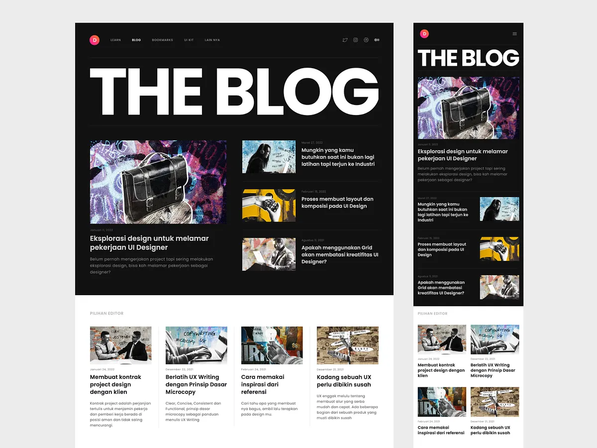
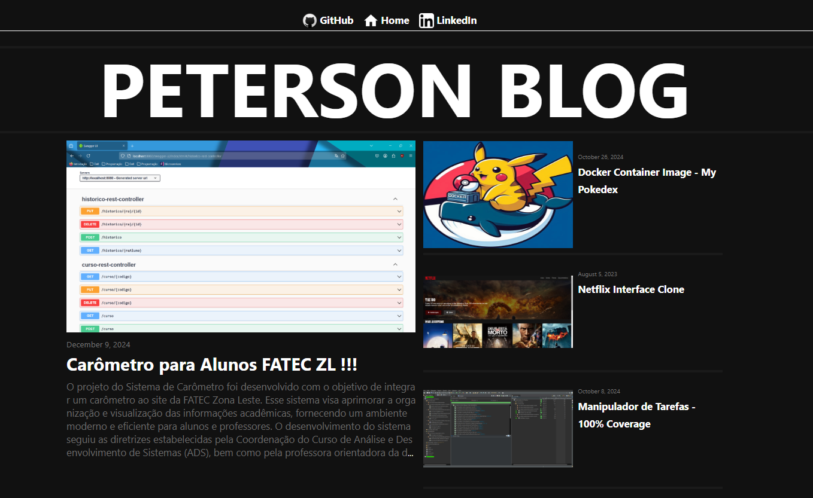

# Blog Peterson

Este é um projeto de blog desenvolvido com o framework Angular 19. O objetivo principal foi criar uma interface semelhante a um design proposto, utilizando componentes e rotas do Angular. Além disso, o blog será utilizado para exibir meus projetos pessoais, que serão integrados à interface para que possam ser visualizados no meu GitHub.

## Funcionalidades

- **Componentes Reutilizáveis**: O projeto foi desenvolvido com foco na criação de componentes reutilizáveis, seguindo as boas práticas do Angular.
- **Rotas**: Utilização de rotas para navegação entre diferentes seções do blog.
- **Design Responsivo**: A interface foi desenvolvida para ser responsiva, garantindo uma boa experiência em dispositivos móveis e desktops.
- **Integração com Projetos Pessoais**: O blog será utilizado para exibir meus projetos pessoais, integrando-os à interface.

## Tecnologias Utilizadas

- **Angular 19**: Framework utilizado para a construção da aplicação.
- **HTML5 e CSS3**: Para a estruturação e estilização da interface.
- **TypeScript**: Linguagem principal para a lógica da aplicação.

## Design Proposto


## Design Desenvolvido _(A Parte 2 da página ainda será implementada)_


## Como Executar o Projeto _(Não Esqueça Você deve ter o AngularCLI Instalado em sua Máquina)_

1. **Abra o Projeto em sua IDE de Preferencia(Utilizei o VSCODE)**:

2. **Instale as dependências**:
   ```bash
    npm install
   ```
3. **Execute o servidor de desenvolvimento**:
   ```bash
    ng serve
   ```
4. **Acesse a aplicação**:
   Abra o navegador e acesse `http://localhost:4200/`.

## Estrutura do Projeto

- **`src/app`**: Contém os componentes, serviços, páginas e módulos da aplicação.
- **`public/`**: Arquivos estáticos como imagens e ícones.
- **`src/styles.css`**: Estilos globais da aplicação.
- **`src/index.html`**: Página principal da aplicação.

## Contribuição

Contribuições são bem-vindas! Se você quiser contribuir para este projeto, siga os passos abaixo:

1. Faça um fork do projeto.
2. Crie uma branch para sua feature (`git checkout -b feature/nova-feature`).
3. Commit suas mudanças (`git commit -m 'Adicionando nova feature'`).
4. Push para a branch (`git push origin feature/nova-feature`).
5. Abra um Pull Request.
